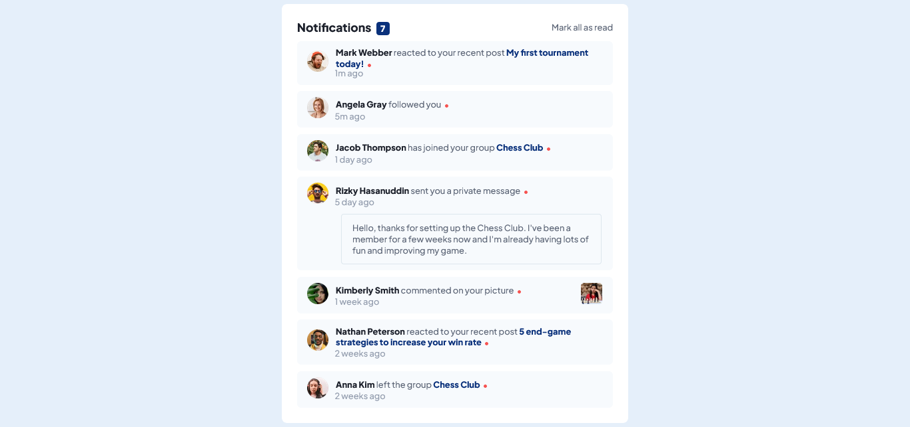
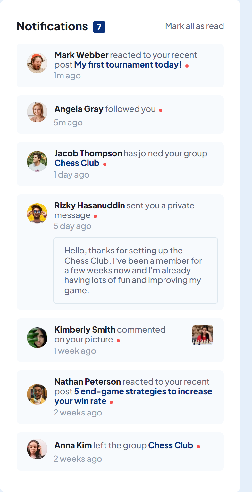

# Frontend Mentor - Notifications page solution

This is a solution to the [Notifications page challenge on Frontend Mentor](https://www.frontendmentor.io/challenges/notifications-page-DqK5QAmKbC). Frontend Mentor challenges help you improve your coding skills by building realistic projects.

## Table of contents

- [Overview](#overview)
  - [The challenge](#the-challenge)
  - [Screenshot](#screenshot)
  - [Links](#links)
- [My process](#my-process)
  - [Built with](#built-with)
  - [What I learned](#what-i-learned)
  - [Continued development](#continued-development)
  - [Useful resources](#useful-resources)
- [Author](#author)

## Overview

### The challenge

## Overview

### The challenge

Users should be able to:

- Distinguish between "unread" and "read" notifications
- Select "Mark all as read" to toggle the visual state of the unread notifications and set the number of unread messages to zero
- View the optimal layout for the interface depending on their device's screen size
- See hover and focus states for all interactive elements on the page

### Screenshot

Below is the screenshots of the challenge, the desktop view is 1440px and the mobile view was queried at 375px.

### Links

- Solution URL: [GitHub Repository](https://github.com/Odo-Peter/notification-page)
- Live Site URL: [Vercel.app](https://notification-page-five.vercel.app)

## My process

### Built with

- Semantic HTML5 markup
- CSS custom properties
- Flexbox
- Javascript

### What I learned

This challenge has taught me the importance of a proper markup and the power of CSS, alongside media queries, also, learnt about the proper use of the forEach loop, a higher order function in JavaScript and further implementing it with JavaScript.

The challenge has also improved my knowledge, in terms of using markdown files and in committing a file to github, basically working with the command line has improved some more, all thanks to this and other frontend mentor's challenge worked on.

### Continued development

In future projects or challenges, I'ld love to add more javascript functions that will toggle the color scheme, to probably a dark and light mode.

### Useful resources

- [Free code camp](https://www.freecodecamp.org) - This site personally has improved my coding skills from 0 to a reasonable figure, lol, I'll recommend any person new to programming and coding to check free code camp for FREE. Ensure to be kind enough to give a little donation to help them to continue giving out value.
- [Tech Twitter](https://www.twitter.com) - Tech twitter has helped with several links to quality resources, articles, podcasts, videos, etc, that has helped to improve my coding skills and thus helping me complete this challenge.
- [W3schools](https://www.w3schools.com) - Awesome and coincise documentations.

## Author

- Twitter - [@Odo_Peter_Ebere](https://www.twitter.com/iCode_X)
- Frontend Mentor - [@Odo-Peter](https://www.frontendmentor.io/profile/Odo-Peter)
